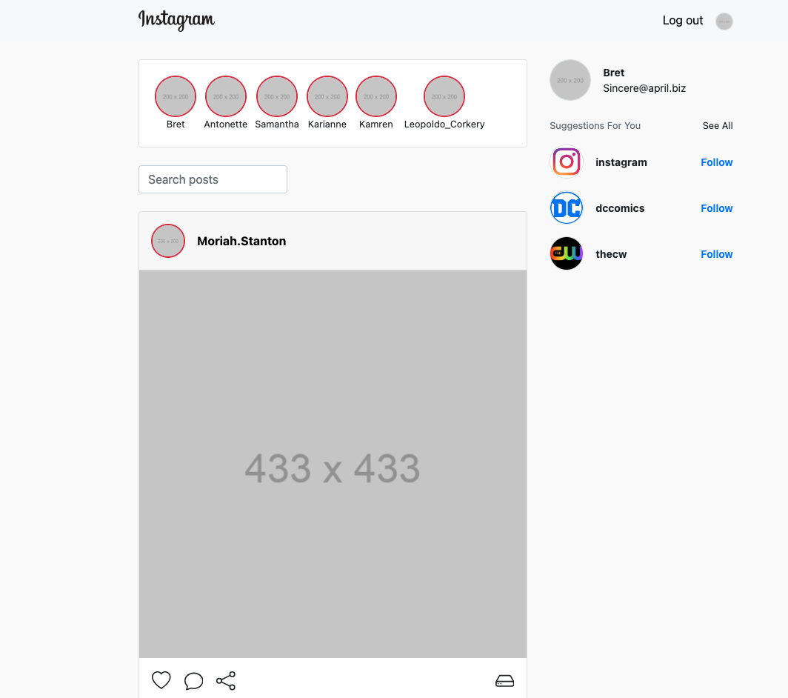

# Instaclone
klon instagrama wykorzystując [placeholder api](https://jsonplaceholder.typicode.com/)

## Instalacja
```bash
npm run dev
```

## Strona logowania

### Dane do logowania
```bash
Login: Sincere@april.biz
Hasło: placeholder
```

## Strona główna (feed)



funkcjonalności:
- wyszukiwanie postów
- po kliknięciu na nazwę użytkownika redirect do profilu użytkownika
- możliwośc dodawania komentarzy
- niezalogowany użytkownik zostaje przekierowany do strony logowania

## Profil użytkownika


funkcjonalności:
- wyświetlanie podstawowych informacji użytkownika
- wyświetlanie postów użytkownika
